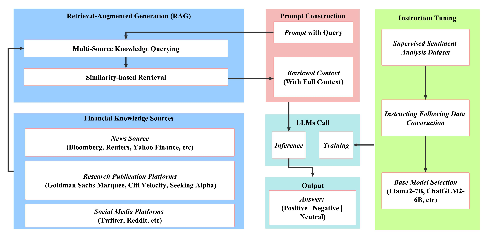
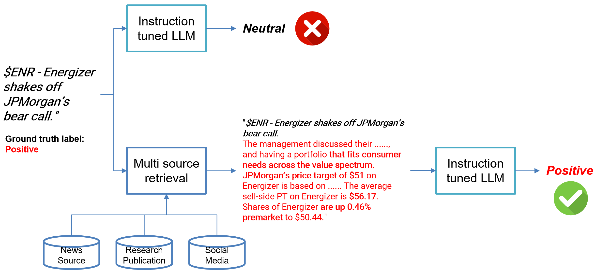

# Enhancing Financial Sentiment Analysis via Retrieval Augmented Large Language Models: Open Source Code

[Our Paper](https://arxiv.org/abs/2310.04027)

## Overview

This repository provides the implementation of a retrieval-augmented Large Language Models (LLMs) framework tailored for financial sentiment analysis. Directly applying LLMs for financial sentiment analysis has challenges, especially when faced with the succinct nature of financial news. Our method addresses these challenges by introducing a two-fold approach: an instruction-tuned LLMs module and a retrieval-augmentation module.

## Abstract

Financial sentiment analysis is critical for valuation and investment decision-making. Traditional NLP models, limited by their parameter size and the scope of their training datasets, often fall short in this area. Large Language Models (LLMs) have demonstrated superior performance across various NLP tasks, but directly applying them to financial sentiment analysis presents its own set of challenges. Our proposed framework, benchmarked against traditional models and other LLMs, achieves a performance gain of 15% to 48% in accuracy and F1 score.

## Key Contributions

1. Introduction of a novel retrieval-augmented large language model framework tailored for financial sentiment analysis, ensuring more nuanced and informed predictions.
2. The unique method of instruction tuning provides a more accurate response to user-intended financial sentiment analysis tasks.
3. Through extensive evaluations, we show that our approach significantly outperforms both traditional sentiment analysis models and renowned general-purpose LLMs.

## Repository Contents

- `multisource_retrieval`: Main code directory for the retrieval augmentation module which enhance the concise query with context.
- `instruction-FinGPT`: Directory containing the code and data related to the instruction-tuned LLMs module.


## Performance
Zero-shot evaluation between BloombergGPT, general-purpose LLMs like ChatGPT, and our model on the dataset of financial phaseBank (FPB).
| Metrics | Accuracy | F1 |
|---------|----------|----|
| BloombergGPT [^1^] | - | 0.51 |
| ChatGPT 4.0 [^2^] | 0.64 | 0.51 |
| ChatGLM2-6B [^3^] | 0.47 | 0.40 |
| Llama-7B [^4^] | 0.60 | 0.40 |
| Ours | **0.76** | **0.74** |

[^1^]: [https://arxiv.org/abs/2303.17564]
[^2^]: [https://arxiv.org/abs/2203.02155]
[^3^]: [https://arxiv.org/abs/2210.02414]
[^4^]: [https://arxiv.org/abs/2302.13971]

Experimental results on the Twitter Val dataset.
| Metrics          | Accuracy | F1    |
|------------------|----------|-------|
| FinBert [^1^]    | 0.725    | 0.668 |
| ChatGLM2-6B [^2^]| 0.482    | 0.381 |
| LLaMA-7B [^3^]   | 0.54     | 0.36  |
| Ours w/o Context | 0.86     | 0.811 |
| Ours w/ RAG Context | **0.88**  | **0.842** |

[^1^]: [https://arxiv.org/abs/1908.10063]
[^2^]: [https://arxiv.org/abs/2210.02414]
[^3^]: [https://arxiv.org/abs/2302.13971]

### A showcase of RAG-instruction-tuned LLM


## Installation and Usage

1. Clone the repository:
```bash
git clone https://github.com/AI4Finance-Foundation/FinGPT.git
```

2. Navigate to the project directory and install the required dependencies:
```bash
cd fingpt/FinGPT_GPT
pip install -r requirements.txt
```

3. Instructions on how to run the model, fine-tune, or evaluate can be found in the respective directories (`instruction-FinGPT`, `multisource_retrieval`). Note the generated .csv file from multisource_retrieval is the input for the instruction-tuned LLM during evaluation.

## Citation

If you find our work useful or use it in your projects, please consider citing our original paper. The bibtex reference will be updated once available.

```
@article{zhang2023instructfingpt,
      title={Instruct-FinGPT: Financial Sentiment Analysis by Instruction Tuning of General-Purpose Large Language Models}, 
      author={Boyu Zhang and Hongyang Yang and Xiao-Yang Liu},
      journal={FinLLM Symposium at IJCAI 2023},
      year={2023}
}
@article{zhang2023fingptrag,
  title={Enhancing Financial Sentiment Analysis via Retrieval Augmented Large Language Models},
  author={Zhang, Boyu and Yang, Hongyang and Zhou, tianyu and Babar, Ali and Liu, Xiao-Yang},
 journal = {ACM International Conference on AI in Finance (ICAIF)},
  year={2023}
}
```

## Feedback and Contributions

We welcome feedback, bug reports, and any contributions to improve the code or extend the model capabilities. Please open an issue or create a pull request, and we'll attend to it promptly.

## License

This project is licensed under the MIT License. See the `LICENSE` file for details.

---

This README provides a structured overview for potential users or contributors to easily understand, use, and potentially contribute to the open-source project.
