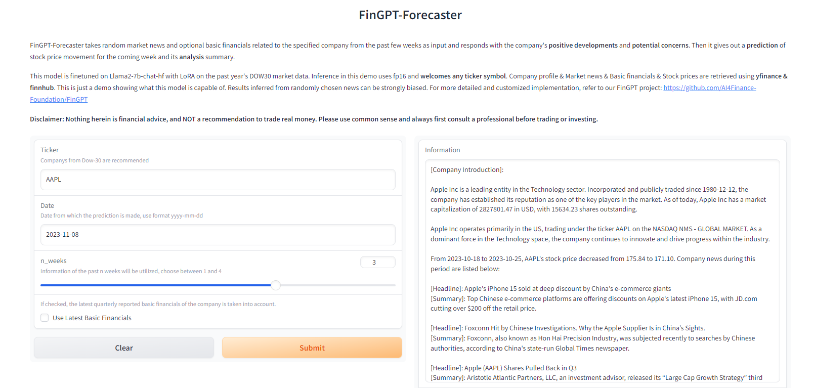
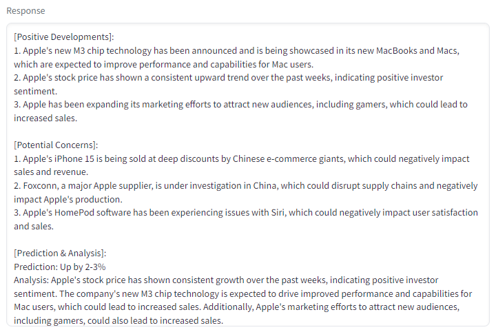

## What is FinGPT-Forecaster?
- FinGPT-Forecaster takes market news and optional basic financials related to the specified company from the past few weeks as input and responds with the company's **positive developments** and **potential concerns**. Then it gives out a **prediction** of stock price movement for the coming week and its **analysis** summary.
- FinGPT-Forecaster is finetuned on Llama-2-7b-chat-hf with LoRA on the past year's DOW30 market data. But also has shown great generalization ability on other ticker symbols.
- FinGPT-Forecaster is an easy-to-deploy junior robo-advisor, a milestone towards our goal.

## Try out the demo!

Try our demo at <https://huggingface.co/spaces/FinGPT/FinGPT-Forecaster>



Enter the following inputs:

1) ticker symbol (e.g. AAPL, MSFT, NVDA)
2) the day from which you want the prediction to happen (yyyy-mm-dd)
3) the number of past weeks where market news are retrieved
4) whether to add latest basic financials as additional information

Then, click Submit！You'll get a response like this



This is just a demo showing what this model is capable of. Results inferred from randomly chosen news can be strongly biased.
For more detailed and customized usage, scroll down and continue your reading.

## Deploy FinGPT-Forecaster

We have released our FinGPT-Forecaster trained on DOW30 market data from 2022-12-30 to 2023-9-1 on HuggingFace: [fingpt-forecaster_dow30_llama2-7b_lora](https://huggingface.co/FinGPT/fingpt-forecaster_dow30_llama2-7b_lora)

We have most of the key requirements in `requirements.txt`. Before you start, do `pip install -r requirements.txt`. Then you can refer to `demo.ipynb` for our deployment and evaluation script.

First let's load the model:

```
from datasets import load_dataset
from transformers import AutoTokenizer, AutoModelForCausalLM
from peft import PeftModel


base_model = AutoModelForCausalLM.from_pretrained(
    'meta-llama/Llama-2-7b-chat-hf',
    trust_remote_code=True,
    device_map="auto",
    torch_dtype=torch.float16,   # optional if you have enough VRAM
)
tokenizer = AutoTokenizer.from_pretrained('meta-llama/Llama-2-7b-chat-hf')

model = PeftModel.from_pretrained(base_model, 'FinGPT/fingpt-forecaster_dow30_llama2-7b_lora')
model = model.eval()
```

Then you are ready to go, prepare your prompt with news & stock price movements in llama format (which we'll mention in the next section), and generate your own forecasting results!
```
B_INST, E_INST = "[INST]", "[/INST]"
B_SYS, E_SYS = "<<SYS>>\n", "\n<</SYS>>\n\n"

prompt = B_INST + B_SYS + {SYSTEM_PROMPT} + E_SYS + {YOUR_PROMPT} + E_INST
inputs = tokenizer(
    prompt, return_tensors='pt'
)
inputs = {key: value.to(model.device) for key, value in inputs.items()}
        
res = model.generate(
    **inputs, max_length=4096, do_sample=True,
    eos_token_id=tokenizer.eos_token_id,
    use_cache=True
)
output = tokenizer.decode(res[0], skip_special_tokens=True)
answer = re.sub(r'.*\[/INST\]\s*', '', output, flags=re.DOTALL) # don't forget to import re
```

## Data Preparation
Company profile & Market news & Basic financials & Stock prices are retrieved using **yfinance & finnhub**.

Prompts used are organized as below:

```
SYSTEM_PROMPT = "You are a seasoned stock market analyst. Your task is to list the positive developments and potential concerns for companies based on relevant news and basic financials from the past weeks, then provide an analysis and prediction for the companies' stock price movement for the upcoming week. Your answer format should be as follows:\n\n[Positive Developments]:\n1. ...\n\n[Potential Concerns]:\n1. ...\n\n[Prediction & Analysis]:\n...\n"

prompt = """
[Company Introduction]:

{name} is a leading entity in the {finnhubIndustry} sector. Incorporated and publicly traded since {ipo}, the company has established its reputation as one of the key players in the market. As of today, {name} has a market capitalization of {marketCapitalization:.2f} in {currency}, with {shareOutstanding:.2f} shares outstanding. {name} operates primarily in the {country}, trading under the ticker {ticker} on the {exchange}. As a dominant force in the {finnhubIndustry} space, the company continues to innovate and drive progress within the industry.

From {startDate} to {endDate}, {name}'s stock price {increase/decrease} from {startPrice} to {endPrice}. Company news during this period are listed below:

[Headline]: ...
[Summary]: ...

[Headline]: ...
[Summary]: ...

Some recent basic financials of {name}, reported at {date}, are presented below:

[Basic Financials]:
{attr1}: {value1}
{attr2}: {value2}
...

Based on all the information before {curday}, let's first analyze the positive developments and potential concerns for {symbol}. Come up with 2-4 most important factors respectively and keep them concise. Most factors should be inferred from company-related news. Then make your prediction of the {symbol} stock price movement for next week ({period}). Provide a summary analysis to support your prediction.

"""
```
## Train your own FinGPT-Forecaster


**Disclaimer: Nothing herein is financial advice, and NOT a recommendation to trade real money. Please use common sense and always first consult a professional before trading or investing.**
